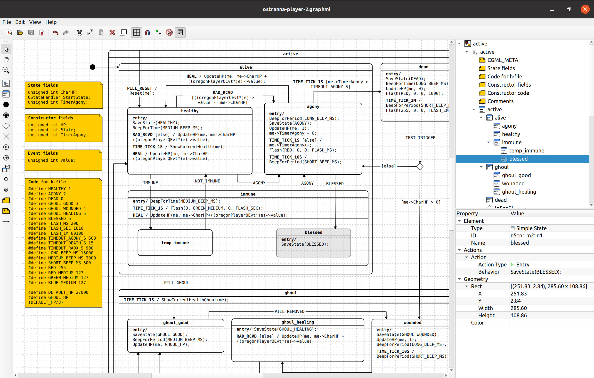
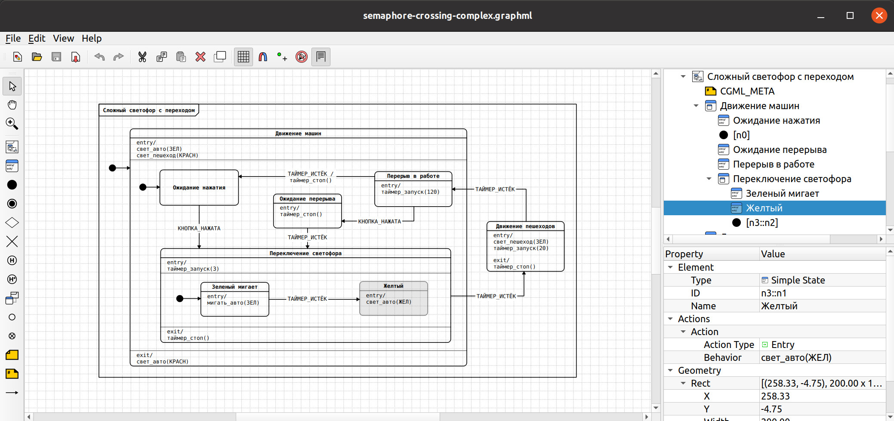

# Редактор Cyberiada расширенных иерархических машин состояний (ПРИМС)


Десктопный визуальный редактор диаграмм ПРИМС проекта Кибериада, базирующийся на
библиотеке Qt. 

Код программы распространяется под лицензией GNU Public License (версия 3),
а документация -- под лицензией GNU Free Documentation License (версия 1.3).

## Редактор

С помощью редактора можно создавать диаграммы и сохранять их в формате
Cyberiada GraphML. Редактор поддерживает множество форматов диаграмм ПРИМС.
Редактор дает возможность изображать множество элементов диаграмм
(состояния, псевдосостояния, переходы и пр.), управлять обзором (зум,
перетаскивание вида), копировать/вставлять объекты, делать отмену операций и
т.п. 





## Установка

Для установки доступны 
под ОС Ubuntu Linux и Windows.

## Требования

* Библиотека [libcyberidaml++](https://github.com/kruzhok-team/libcyberiadamlpp/)
  и ее зависимости: [libcyberiadaml](https://github.com/kruzhok-team/libcyberiadaml),
  [libhtreegeom](https://github.com/kruzhok-team/libhtreegeom), а также libxml2 
* cmake (версия 3.12+)
* Библиотека Qt версии 5.x
* [QtPropertyBrowser](https://github.com/greenjava/QtPropertyBrowser/)

## Сборка из исходников

Для конфигурации и сборки проектов используется CMake:

```
cmake -B build
cmake --build build
```

Если зависимости не усановлены глобально, добавляйте при сборке параметр
`-DCMAKE_PREFIX_PATH=<prefix>`, чтобы правильно указать директорию для
`find_package`.

Пакет под дистрибутив семейства Debian можно получить командой `cpack -G DEB`
из директории сборки.

Для сборки под Windows есть отдельная инстукция: [docs/BUILDING-WINDOWS.md](docs/BUILDING-WINDOWS.md).

## Тестирование

Редактор имеет консольную систему тестирования и режим исполнения команд в
командной строке, который опирается на режим offscreen библиотеки Qt. После
сборки проекта запустите скрипт `./run-tests.sh` из корня репозитория. Также
изучите документ `docs/TESTING.md`, описывающий архитектуру системы
тестирования, режим консольного исполнения команд и уровни тестирования. Еще
можно изучить документация к тестовому полигону с применением ИИ-агентов:  
`docs/POLYGON.md`.
