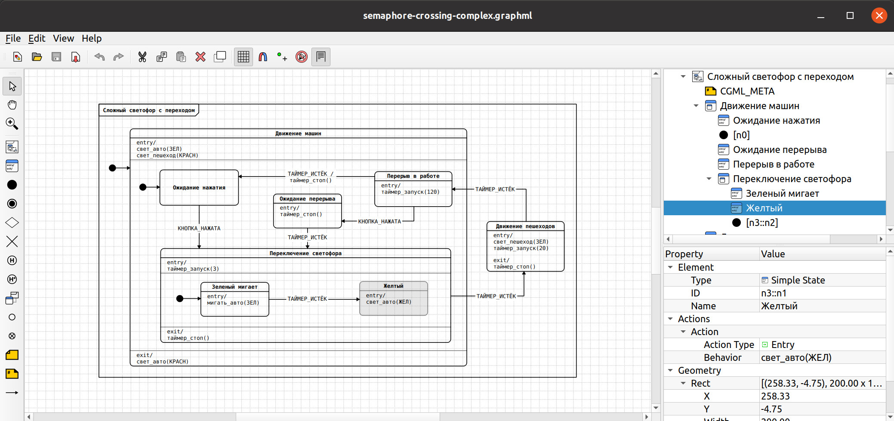

# The Cyberiada Hierarchical State Machines Editor


The visual editor program for Cyberiada HSM graphs based on the Qt Framework.

The code is distributed under the GNU Public License (version 3), the documentation -- under
the GNU Free Documentation License (version 1.3).

## The Editor

The editor is able to create HSM diagrams and edit Cyberiada GraphML files.
It suports multiple HSM formats and has many drawing tools - HSM diagram
elements (states, pseudostate, transitions, etc.), view management (zoom,
pan), copy/paste, undo/redo, etc.



## Requirements

* [libcyberidaml++](https://github.com/kruzhok-team/libcyberiadamlpp/) and its required parts: [libcyberiadaml](https://github.com/kruzhok-team/libcyberiadaml), [libhtreegeom](https://github.com/kruzhok-team/libhtreegeom) and libxml2 
* cmake (version 3.12+)
* Qt Framework version 5.x
* [QtPropertyBrowser](https://github.com/greenjava/QtPropertyBrowser/)

## Installation

Configure and build with CMake:

```
cmake -B build
cmake --build build
```

If the dependencies are not in the default system location, point
`find_package` at them with `-DCMAKE_PREFIX_PATH=<prefix>`.

Build a Debian package with `cpack -G DEB` from the build directory.

To build on Windows, see [docs/BUILDING-WINDOWS.md](docs/BUILDING-WINDOWS.md).

## Testing

The editor has a console test system based on the batch mode and the Qt
offscreen platform. Build the project, then run `./run-tests.sh` from the
repository root. See `docs/TESTING.md` for the testing architecture, the
batch mode contract and the test layers, and `docs/POLYGON.md` for the
agent-driven test polygon.

